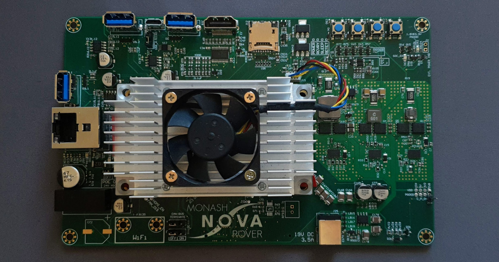

# jetson-tx2-novacarrier
Resources for setting up a Jetson TX, to run on the [Monash Nova Rover](https://www.novarover.space/) NVIDIA Jetson TX2 carrier board, the **Novacarrier**.



# Requirements
- Linux-ish computer (Ubuntu 18.04+ recommended)
- `bash` shell
- ~30GB+ storage space
- ~3GB+ of internet download quota

# Getting started
### To build and compile the image sources
```bash
git clone https://github.com/leighleighleigh/jetson-tx2-novacarrier
cd jetson-tx2-novacarrier
sudo ./setup.sh # Follow the prompts 
sudo ./build.sh # Follow the prompts
```
### To flash the image to the Jetson
```bash
cd local/Linux_for_Tegra/

# Enable the micro USB port
# On the novacarrier, you need to switch the jumper 
# from 'USB_A' to 'MICRO'. 
# MICRO = Jumper position is closest to edge of board
# USB_A = Jumper position is closest to center of board

# Put jetson into recovery mode
# 1. Turn on 12V power to the carrier
# 2. Hold down RCVRY button for 2 seconds
# 3. While holding RCVRY, Tap the POWER button to start the system
# 4. Release the RCVRY button after 2 seconds

# Check it exists
lsusb | grep "recovery"

# Begin flashing
sudo ./flash.sh jetson-tx2-devkit mmcblk0p1
```

# Directory reference
```bash
├── setup.sh # The first script you should run.
├── build.sh # Builds the kernel from source and puts it in the correct folder, so it can be flashed to the jetson
├── dts # Contains custom device tree and config files specific to the novacarrier - these are used during kernel compilation
├── jetson_scripts # Some scripts you can use on a Jetson when it's running, EG to setup the CAN interfaces.
├── local # This is where all the work is done. Archives, Linux_for_Tegra, and other files are put here. This folder is .gitignored.
├── patches # Contains kernel file patches, which for some reason NVIDIA hasn't implemented yet
├── README.md # Hello there
├── scripts # Contains extra bash scripts used by setup.sh and build.sh. Do not run these please.
├── media # ooh pretty pcbs
```
